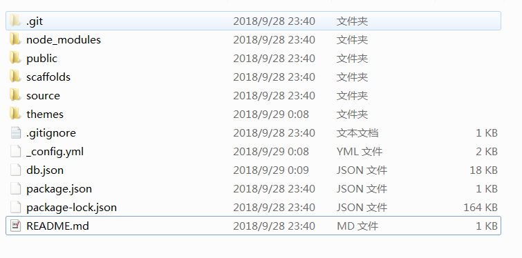

前几天在阿里云上买了个域名，想把自己的博客整好点，*xx.github.io* 这样的网址有点low了。五十几块钱可以用三年，还送了一张爱奇艺一个月的会员卡，确实不贵。

以下是几点理解，有助于部署自己域名博客。

- **xx.github.io**项目里要有个CNAME文件，填买的域名

- 把这个CNAME文件放到hexo的public文件夹里，这样执行**hexo d**命令部署的时候github项目里就有CNAME文件了

- **hexo d**的作用就是把deploy目录清空，然后把public文件拷贝到deploy目录，最后将deploy目录里的文件夹用git上传到**xx.github.io**项目里，会**覆盖**之前的文件

- **themes**文件夹里是主题项目，如果设置的主题项目文件不完整，**hexo g**生成index文件会失败

- 如过想在不止一个电脑上用hexo写博客，最好把hexo项目上传github上，每次写完也把hexo项目提交做个备份，这样在其他电脑上只要拉一下hexo项目，之前的文件就不会丢失

**参考链接：** 
[搭建Hexo博客步骤](https://www.jianshu.com/p/0cadd1bd7122) 
[博客设置域名](http://www.cnblogs.com/liuxianan/p/build-blog-website-by-hexo-github.html?_blank) 
[插入图片音乐视频](https://blog.csdn.net/qq_26891045/article/details/51693571)
